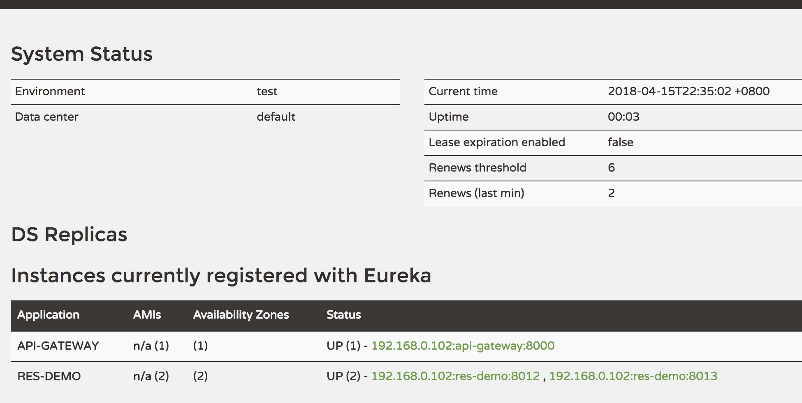

##简介：
内容主要包含：

| 微服务角色                 | 对应的技术选型                              |
| --------------------- | ------------------------------------ |
| 注册中心(Register Server) | Eureka                               |
| 服务提供者                 | spring mvc、spring-data-jpa、h2等       |
| 服务消费者                 | Ribbon/Feign消费服务提供者的接口               |
| 熔断器                   | Hystrix，包括Hystrix Dashboard以及Turbine |
| 配置服务                  | Spring Cloud Config Server           |
| API Gateway           | Zuul                                 |

## 环境准备：

| 工具    | 版本或描述                |
| ----- | -------------------- |
| JDK   | 1.8                  |
| IDE   | STS 或者 IntelliJ IDEA |
| Maven | 3.x                  |
| spring clound | Dalston.SR5 |
| spring boot | 1.5.6 |
## 主机名配置：

| 主机名配置（C:\Windows\System32\drivers\etc\hosts文件） |
| ---------------------------------------- |
| 127.0.0.1 discovery gateway config-server|

## 主机规划：

| 项目名称                                               | 端口   | 描述                             | 
| ----------------------- | ---- | ------------ |
| api-gateway             | 8000 | API Gateway  | 
| config-server-eureka    | 8001 | 配置服务                   | 
| hystrix-dashboard       | 8002 | hystrix统计         | 
| reg-discovery           | 8761 | 服务注册发现中心     | 
| res-user                | 8010 | user资源服务             | 
| res-company             | 8011 | company资源服务      | 

## 测试:
 
 
 